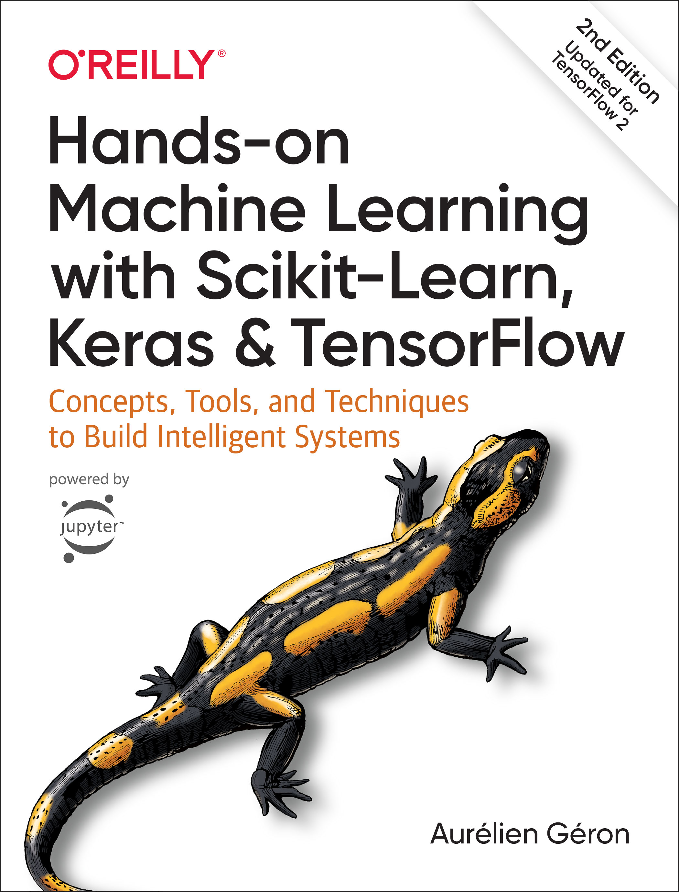

This repository contains my practice notebooks from reading Hands-On Machine Learning by Auerelien Geron.
It's an amazing book which I highly recommend to anyone, especially if you are having trouble connecting theory to application. 

The second chapter alone has really helped put the different parts of a data science project into perspective.
From developing a target to deploying and monitoring a model in the first 100 pages, it's already answered many of my questions.

**Note:** While the code and visualizations may seem familiar, please pay more attention to the notes and comments while skimming the content. I hope they can help add immediate value to you in some way.

[Goodreads (reviews and purchase options)](https://www.goodreads.com/book/show/40363665-hands-on-machine-learning-with-scikit-learn-keras-and-tensorflow?from_search=true&from_srp=true&qid=FASvNdZk1R&rank=2)
